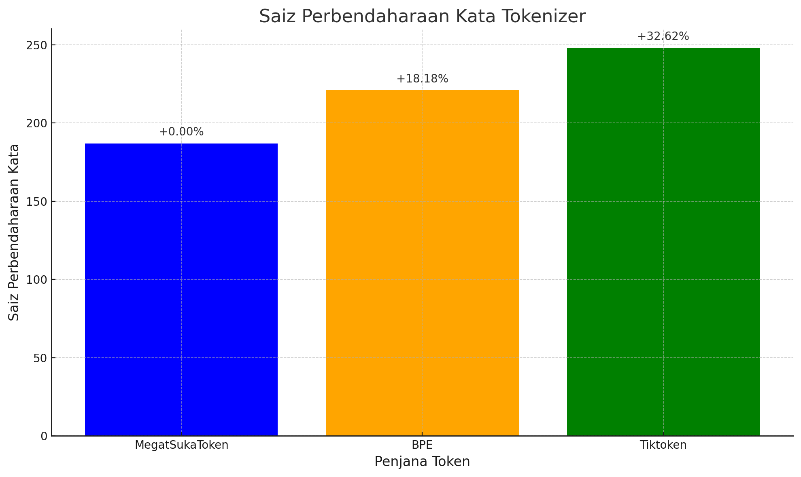

# MegatSukaToken: Suku Kata Tokenizer for Malay

## Overview
**MegatSukaToken** is a syllable-based tokenizer specifically designed for the Malay language. It tokenizes text into meaningful syllables based on Malay linguistic rules, ensuring better alignment with the language's morphological structure. This tokenizer is compared against Byte Pair Encoding (BPE) and tiktoken tokenizers to evaluate its effectiveness in handling Malay text.

## Key Features
- **Syllable-Based Tokenization**: Splits words into syllables, which are linguistically meaningful units in Malay.
- **Efficient Vocabulary Usage**: Produces a smaller vocabulary size compared to BPE and tiktoken, while preserving linguistic accuracy.
- **Seamless Integration**: Easily integrates with other NLP pipelines for Malay text processing.

## Comparison Results
### Vocabulary Sizes
| Tokenizer        | Vocabulary Size | Difference vs. MegatSukaToken |
|------------------|----------------|--------------------------------|
| **MegatSukaToken** | 187            | -                            |
| **BPE**          | 221            | +18.18%                      |
| **Tiktoken**     | 248            | +32.62%                      |

### Visualization


## Why MegatSukaToken?
1. **Better Morphological Alignment**: Tokens align with Malay syllables, improving linguistic accuracy.
2. **Smaller Vocabulary**: Reduces computational complexity while maintaining tokenization quality.
3. **No Arbitrary Subwords**: Avoids artificial prefixes like `##` used in BPE/tiktoken for out-of-vocabulary handling.

## Installation
1. Clone the repository:
   ```bash
   git clone https://github.com/maercaestro/megat-sukatoken.git
   ```
2. Navigate to the project directory:
   ```bash
   cd megat-sukatoken
   ```
3. Install dependencies:
   ```bash
   pip install -r requirements.txt
   ```

## Usage
### Tokenization
```python
from suku_kata_tokenizer import MegatSukaToken

# Initialize the tokenizer
tokenizer = MegatSukaToken()

# Tokenize a sentence
text = "berlari ke pasar"
tokens = tokenizer.tokenize(text)
print("Tokens:", tokens)
```

### Build Vocabulary
```python
# Sample dataset
dataset = [
    "berlari ke pasar",
    "saya suka belajar",
    "pengkritik sedang menulis"
]

# Build vocabulary
vocab = tokenizer.build_vocab(dataset)
print("Vocabulary:", vocab)
```

### Save Vocabulary
```python
# Save vocabulary to a file
vocab_file = "data/suku_kata_vocab.json"
tokenizer.save_vocab_to_file(vocab, vocab_file)
print(f"Vocabulary saved to {vocab_file}")
```

## Evaluation
### Comparison Script
The repository includes a script to compare the performance of **MegatSukaToken** against BPE and tiktoken tokenizers. To run the comparison:
```bash
python compare_tokenizers.py
```

### Example Output
```plaintext
Vocabulary Sizes:
Suku Kata Vocabulary Size: 187
BPE Vocabulary Size: 221 (+18.18% vs. Suku Kata)
Tiktoken Vocabulary Size: 248 (+32.62% vs. Suku Kata)
```

## Dataset
This project utilizes the [maercaestro/pantun](https://huggingface.co/datasets/maercaestro/pantun) dataset from Hugging Face for evaluating tokenizers.

## Contributing
Contributions are welcome! Feel free to submit issues or pull requests to enhance the functionality or add new features.

## License
This project is licensed under the MIT License. See the [LICENSE](./LICENSE) file for details.

## Acknowledgments
- [Hugging Face](https://huggingface.co/) for providing datasets and tools.
- The Malay NLP community for inspiring this project.

## Contacts
You may contact me at [maercaestro@gmail.com]

